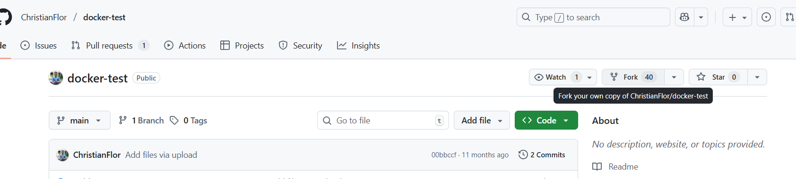
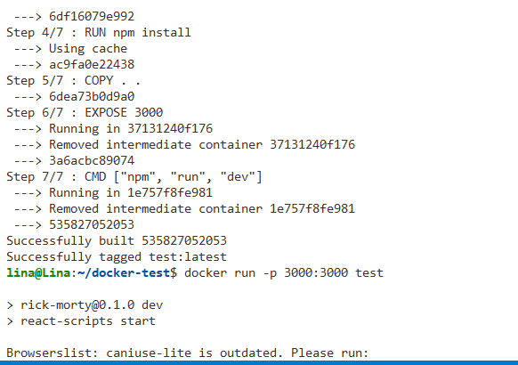
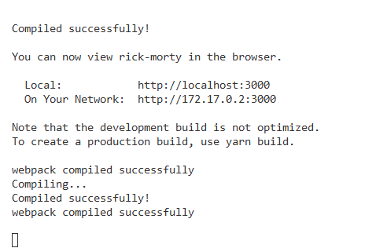
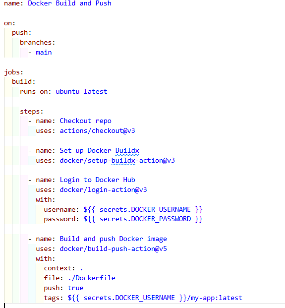

Evidence of work

First, I quickly reviewed the folders and their contents to understand what needed to be taken into account when creating the dockerfile so that the services could function optimally. With this in mind, I proceeded to create a simple dockerfile. I initially had some problems with this due to the initialization of “npm start,” which is supposed to be placed in production environments. However, it was being assigned at the time of creating the container, so it wasn't going to work. Instead, it was replaced with:

CMD ["npm", "run", "dev"]

After that, and with the service up and running, we proceeded to create the pipeline in GitHub Actions, resulting in the following:

However, it is also important to remember to create secrets within the GitHub Actions environment. Then, the pipeline is uploaded and its status is validated, as well as whether or not the image was published within Docker Hub. 